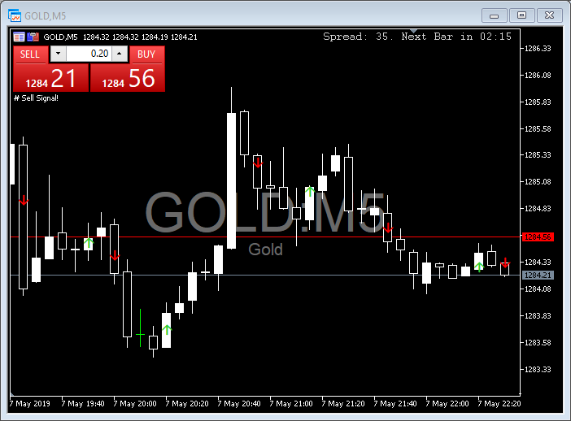
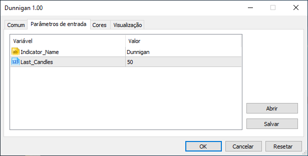

----
## MetaTrader 5 > Indicator > Dunnigan

### Description:
Trend indicator created by William Dunnigan that fires a signal to buy or sell accordingly to the following rules:

* **Buy Signal** = Fired at the **first candlestick** wich *close price* is higher than the *higher price* of the last candlestick. The *higher and lower prices* of the current candlestick must be higher than the corresponding ones of the last candlestick as well.

* **Sell Signal** = Fired at the **first candlestick** wich *close price* is lower than the *lower price* of the last candlestick. The *higher and lower prices* of the current candlestick must be lower than the corresponding ones of the last candlestick as well.

### Parameters:

* **Last_Candles** = Number of chart's last candlesticks to be evaluated. Defaults to 50.

----
### Instructions:
1. Double-click on *mq5* file should open **MetaEditor**.
2. Click *'Compile'* button on **MetaEditor**.
3. On **MetaTrader**, insert this compiled indicator into the chart you want.

----
### References:
* [MQL5 Documentation](https://www.mql5.com/en/docs)
* 
